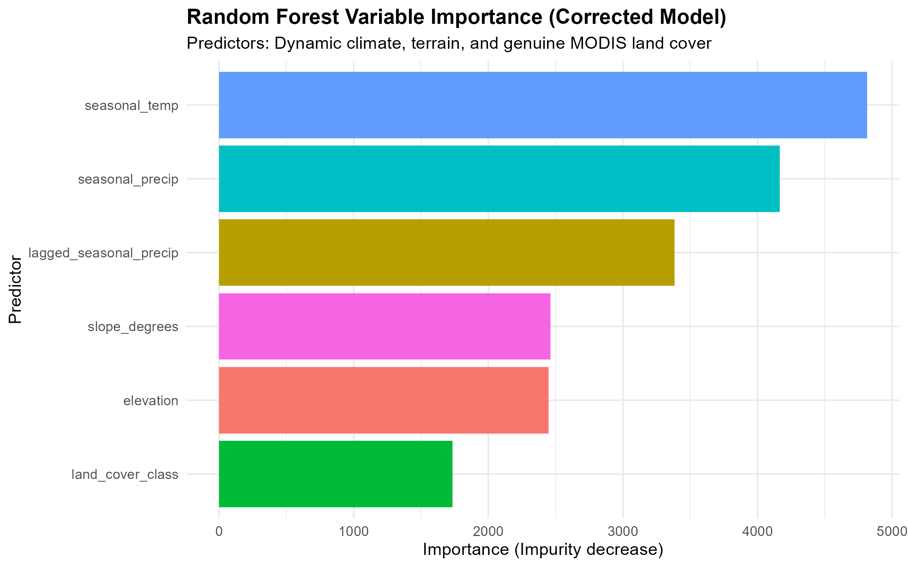
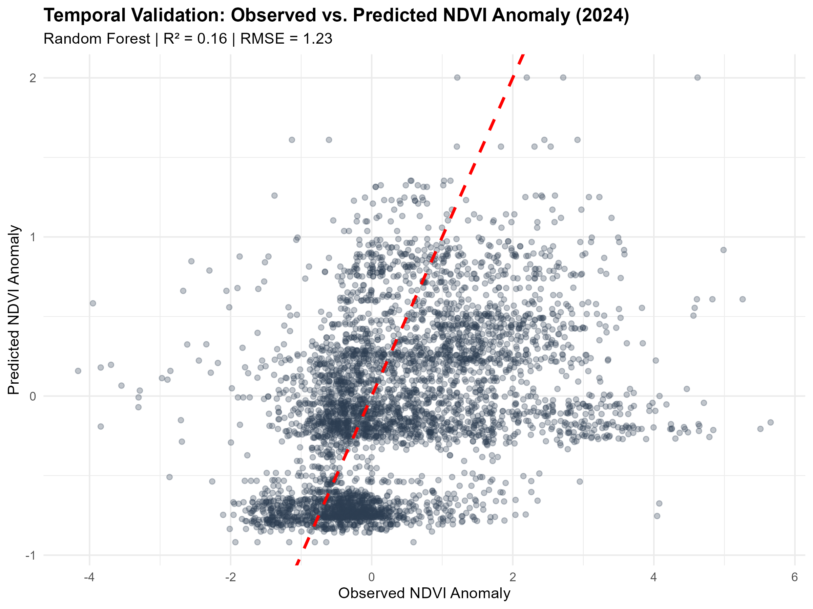
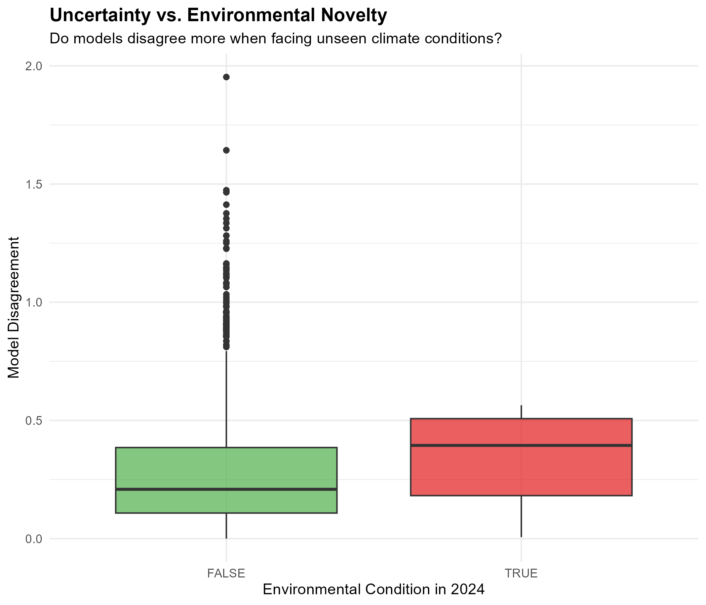

# 🌱 Cholistan Vegetation Stress Analysis

I developed a reproducible R workflow to model seasonal vegetation anomalies in the Cholistan Desert using MODIS NDVI, time-varying climate predictors, terrain, and land cover. I compared an interpretable statistical model (GAM) with Random Forest using spatial-block cross-validation and a held-out year. I quantified model disagreement and environmental novelty to distinguish reliable predictions from areas requiring further validation.

*This project was developed as a portfolio piece for the GEM Track 4: Geospatial Modeller application.*

## 📍 Study Area
The analysis focuses on three districts in southern Punjab, Pakistan: **Bahawalpur, Bahawalnagar, and Rahim Yar Khan**. The study period covers **2018–2024**, with 2024 strictly held out for temporal validation.

## 🛰️ Data Sources
*   **Vegetation Response:** MODIS MOD13Q1 (250m, 16-day NDVI). Processed into seasonal Z-score anomalies.
*   **Dynamic Climate:** NASA POWER API (Monthly seasonal precipitation, lagged precipitation, and mean temperature).
*   **Terrain:** SRTM Digital Elevation Model (DEM) and derived slope.
*   **Land Cover:** MODIS MCD12Q1 Version 6.1 (2021) IGBP classification (Bare/Sparse, Grass/Shrub, Cropland, Other).

*(See `data/data_sources.md` for detailed acquisition and processing notes).*

## 🧠 Methodology & Scientific Corrections

### 1. Response Variable: Seasonal NDVI Anomaly
The primary response is the standardized seasonal NDVI anomaly (Z-score). 
*   **Leakage Prevention:** The seasonal baseline (mean and standard deviation) is calculated strictly using the **2018–2023 training period**, grouped by `latitude`, `longitude`, and `season`. 
*   The 2024 hold-out data is joined to this training-derived baseline without altering it.
*   *(Note: Raw NDVI residual analysis was tested as a supplementary diagnostic, but the anomaly-based approach is the primary scientific method to avoid circularity).*

### 2. Predictor Design
*   **Dynamic Climate:** Replaced static WorldClim averages with time-varying seasonal precipitation, lagged precipitation (to capture soil moisture memory), and seasonal temperature.
*   **Terrain & Land Cover:** Added slope (degrees) and genuine MODIS MCD12Q1 land cover as independent categorical predictors.

### 3. Validation Strategy
*   **Spatial Blocking:** 4 K-means spatial blocks to reduce proximity between training and test observations.
*   **Temporal Hold-out:** Models are trained exclusively on 2018–2023 and evaluated on 2024.
*   **Metrics:** RMSE, MAE, and R-squared are calculated for every fold and summarized.

### 4. Uncertainty & Novelty Analysis
*   **Model Disagreement:** Absolute difference between GAM and Random Forest predictions to proxy uncertainty.
*   **Environmental Novelty (MESS-style):** Flagging 2024 observations where climate predictors fall outside the 5th–95th percentile range of the training data.

## 📈 Key Results

### Variable Importance
Random Forest identified **seasonal temperature**, **seasonal precipitation**, and **lagged precipitation** as the primary drivers of vegetation dynamics, validating the need for time-varying climate data.

### Temporal Validation (2024 Hold-out)
The model maintains predictive skill on unseen 2024 data, with Random Forest outperforming GAM in handling complex, non-linear desert ecological interactions.

### Uncertainty vs. Environmental Novelty
Models show significantly higher disagreement (uncertainty) when predicting vegetation responses under novel climate conditions (outside the 2018–2023 training distribution).

## 📂 Repository Structure
*   `R/`: Reproducible R scripts, numbered sequentially according to the workflow.
*   `data/raw/`: Raw downloaded spatial data (ignored by Git).
*   `data/processed/`: Cleaned CSVs, processed rasters, and the `data_dictionary.csv`.
*   `outputs/figures/`: All generated plots, validation charts, and maps.
*   `config.yaml`: Centralized configuration for paths and parameters.

## 🔄 How to Rerun
1. Ensure R (>= 4.3.0) is installed.
2. Install required packages: `install.packages(c("tidyverse", "terra", "sf", "mgcv", "ranger", "MODISTools", "yaml", "here"))`
3. Open `cholistan-vegetation-stress.Rproj` in RStudio.
4. Run the scripts in `R/` sequentially from `03_` through `08_`.

## 📜 License & Citation
This project is licensed under the MIT License. See `LICENSE` and `CITATION.cff` for details.