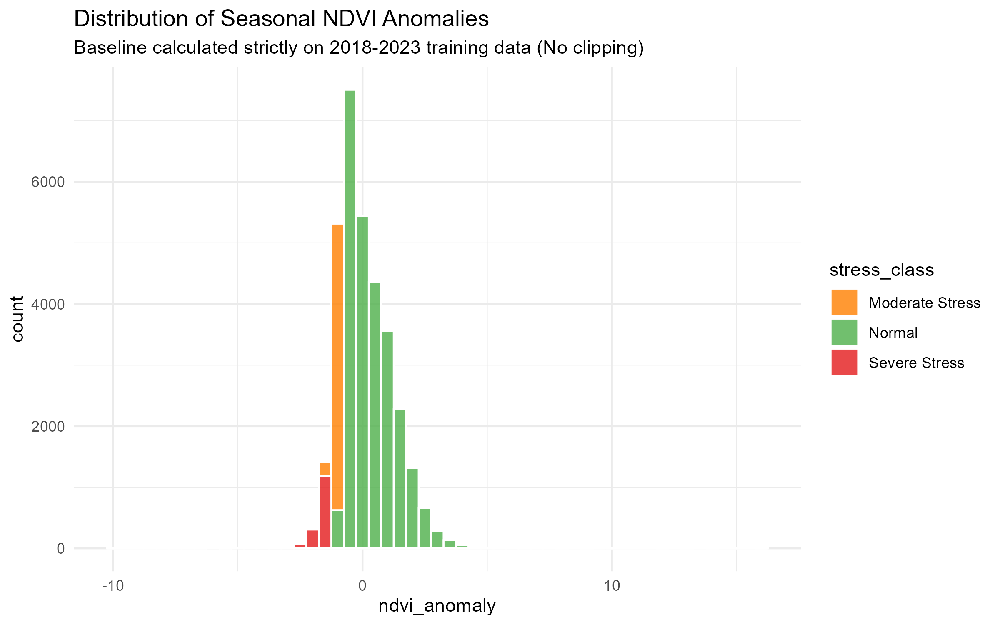

# 🌱 Cholistan Vegetation Stress Analysis

This repository contains a reproducible geospatial machine learning pipeline for modelling seasonal vegetation anomalies in the Cholistan Desert region of Pakistan. This project was developed as a portfolio piece for the GEM Track 4 Master's application.

## 📍 Study Area
The analysis focuses on three districts in southern Punjab: **Bahawalpur, Bahawalnagar, and Rahim Yar Khan**.

## 🛰️ Data Sources
*   **Vegetation Data:** MODIS MOD13Q1 (250m, 16-day NDVI) from 2018–2024.
*   **Climate Data:** WorldClim Bioclimatic Variables (used as static background climate).
*   **Terrain Data:** SRTM Digital Elevation Model (DEM).

## 🧠 Methodology

### 1. Response Variable: Seasonal NDVI Anomaly
The primary response variable is the standardized seasonal NDVI anomaly (Z-score). 
* **Correction:** To prevent temporal data leakage, the seasonal baseline (mean and standard deviation) is calculated **strictly using the 2018–2023 training period**. 
* The baseline is grouped by `latitude`, `longitude`, and `season`.
* 2024 data is joined to this training-derived baseline to calculate the true anomaly for the hold-out year.
* *(Note: Raw NDVI residual analysis was also tested as an exploratory diagnostic, but the anomaly-based approach is the primary scientific method.)*

### 2. Spatial Blocking
To prevent spatial autocorrelation leakage, the study area was divided into 4 spatial blocks using K-Means clustering. Models are trained on 3 blocks and tested on the 4th.

### 3. Modelling & Validation
* **Models:** Generalized Additive Model (GAM) and Random Forest.
* **Validation:** 4-fold spatial block cross-validation and a strict 2024 temporal hold-out.
* **Metrics:** RMSE, MAE, and R-squared are calculated for all folds.

## 📈 Key Results

### Variable Importance
The Random Forest model identified **Elevation** and **Precipitation Seasonality** as key drivers of vegetation dynamics in this arid ecosystem.

## 📂 Repository Structure
* `R/`: Contains all reproducible R scripts (numbered sequentially).
* `data/raw/`: Raw downloaded spatial data (ignored by Git to save space).
* `data/processed/`: Cleaned CSVs and processed rasters.
* `outputs/figures/`: All generated plots and maps.