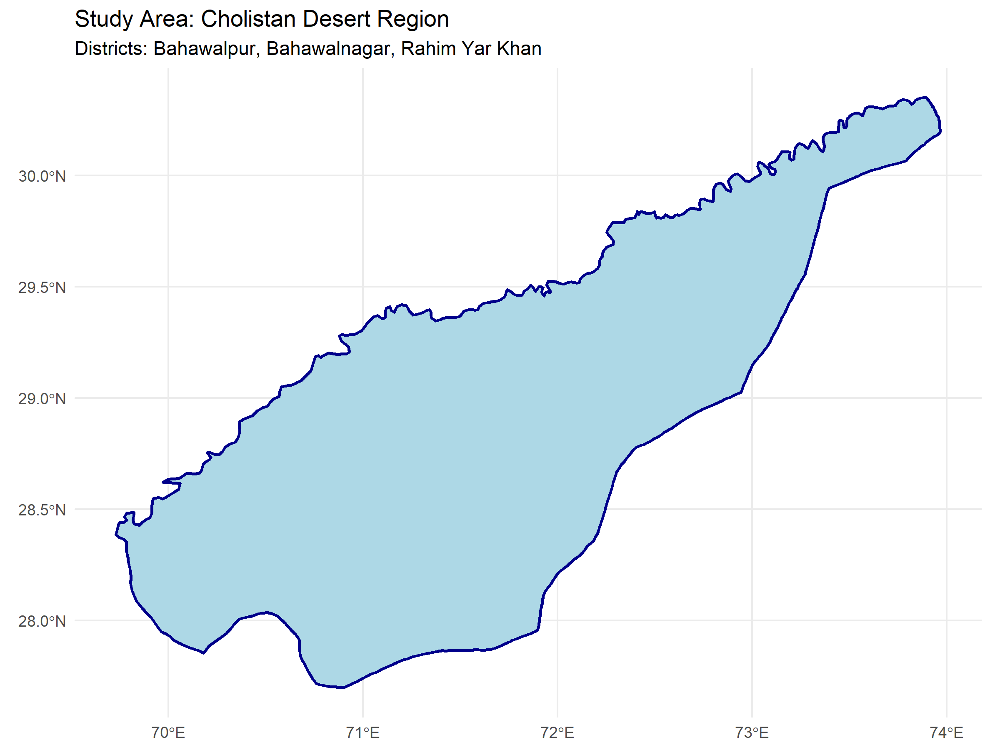
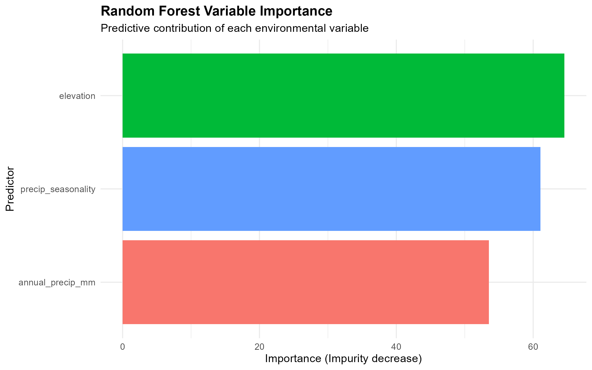
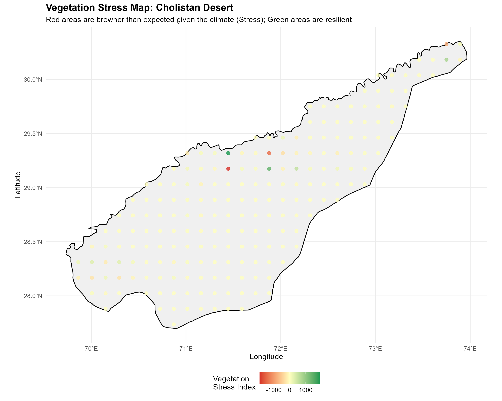

# 🌱 Cholistan Vegetation Stress Analysis

This repository contains the complete geospatial machine learning pipeline for analyzing vegetation stress in the Cholistan Desert region of Pakistan. This project was developed as a portfolio piece for the GEM Track 4 Master's application.

## 📍 Study Area
The analysis focuses on three districts in southern Punjab: **Bahawalpur, Bahawalnagar, and Rahim Yar Khan**.

## 🛰️ Data Sources
*   **Vegetation Data:** MODIS MOD13Q1 (250m, 16-day NDVI) from 2018–2024.
*   **Climate Data:** WorldClim Bioclimatic Variables (Annual Precipitation and Seasonality).
*   **Terrain Data:** SRTM Digital Elevation Model (DEM).

##  Methodology
1.  **Response Variable:** Calculated standardized seasonal NDVI anomalies (Z-scores) to identify deviations from normal vegetation conditions.
2.  **Spatial Blocking:** Used K-Means clustering to divide the study area into 4 spatial blocks for robust cross-validation, preventing spatial autocorrelation leakage.
3.  **Modelling:** Applied a Random Forest algorithm to predict Raw NDVI based on environmental predictors.
4.  **Stress Mapping:** Calculated model residuals (Actual - Predicted) to map areas of unexplained vegetation stress (browner than expected) and resilience (greener than expected).

## 📈 Key Results

### Variable Importance
The Random Forest model identified **Elevation** and **Precipitation Seasonality** as the primary drivers of vegetation dynamics in this arid ecosystem.

### Final Vegetation Stress Map
The map below visualizes the model residuals. **Red dots** indicate areas of severe stress (vegetation is browner than the climate would predict), while **green dots** indicate resilient areas.

## 📂 Repository Structure
*   `R/`: Contains all reproducible R scripts (numbered sequentially).
*   `data/raw/`: Raw downloaded spatial data (ignored by Git to save space).
*   `data/processed/`: Cleaned CSVs and processed rasters.
*   `outputs/figures/`: All generated plots and maps.