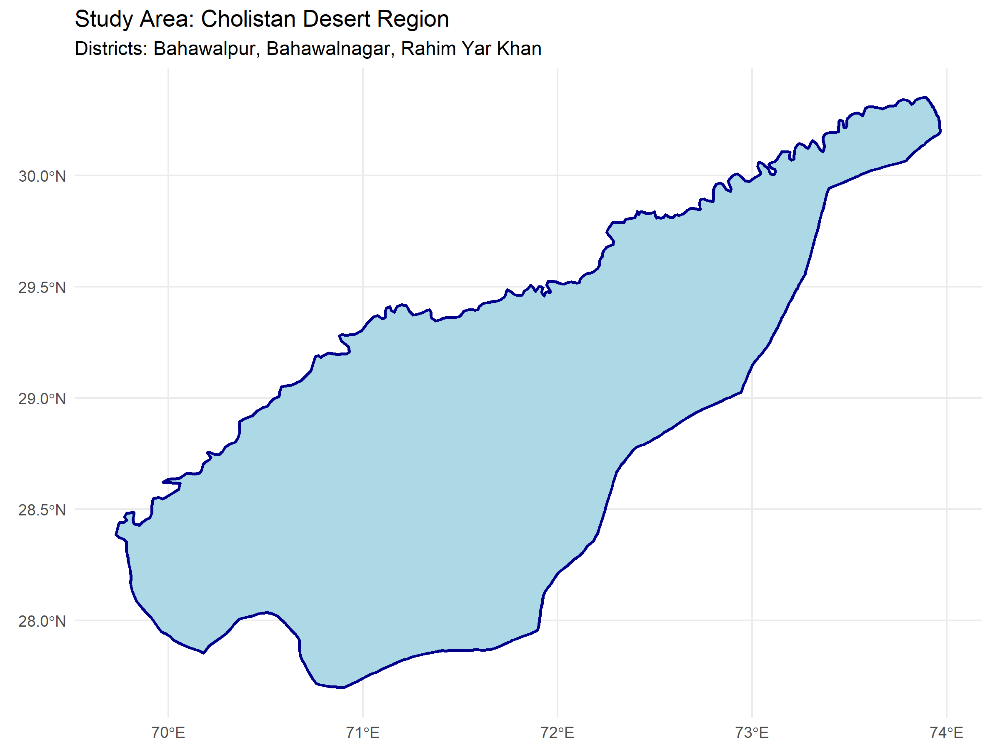
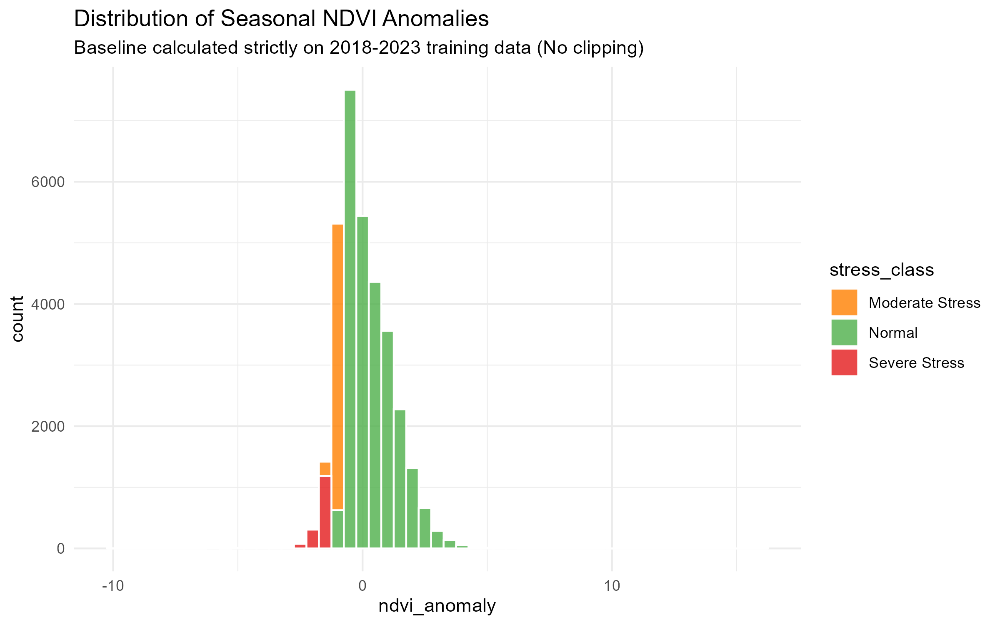
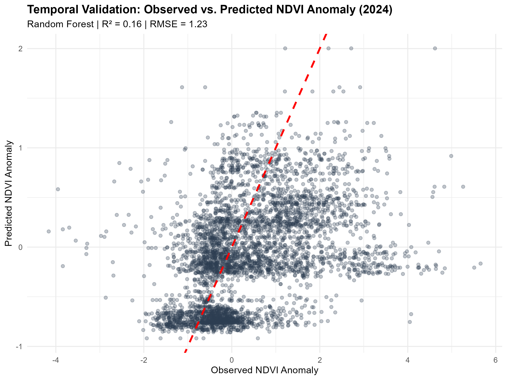
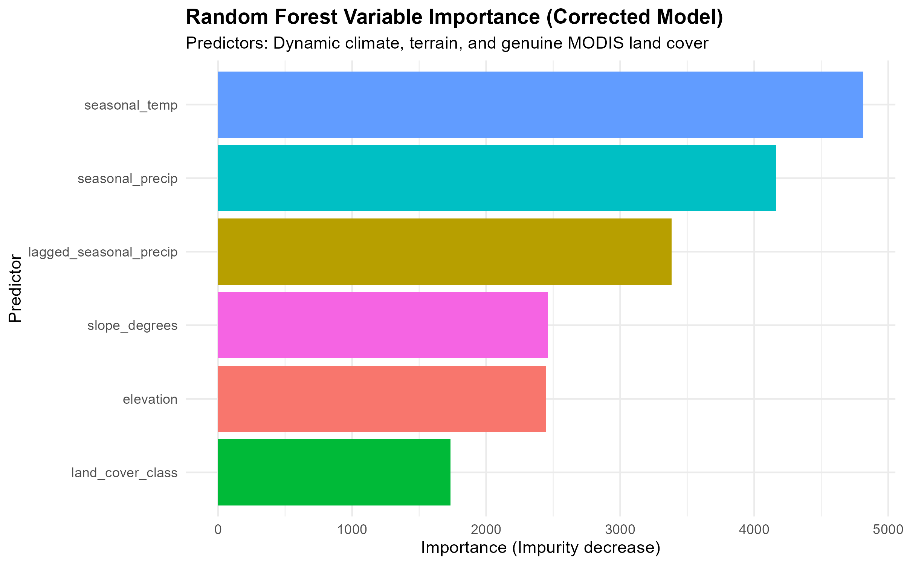
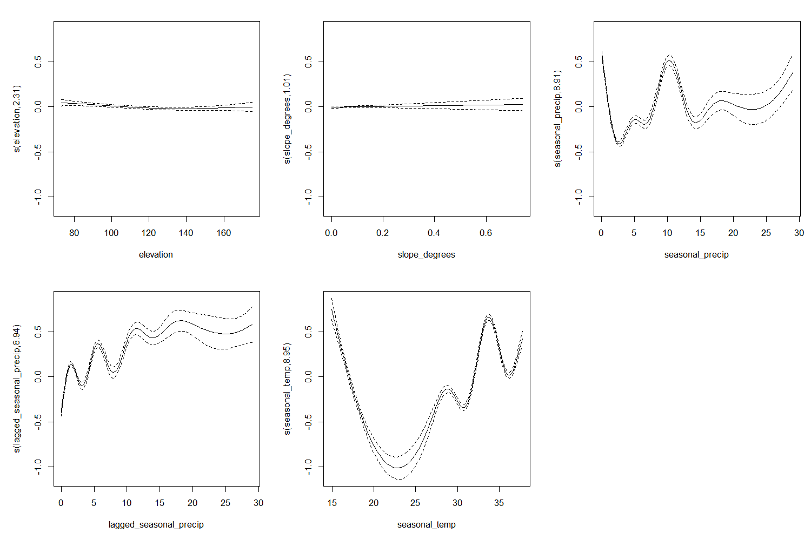
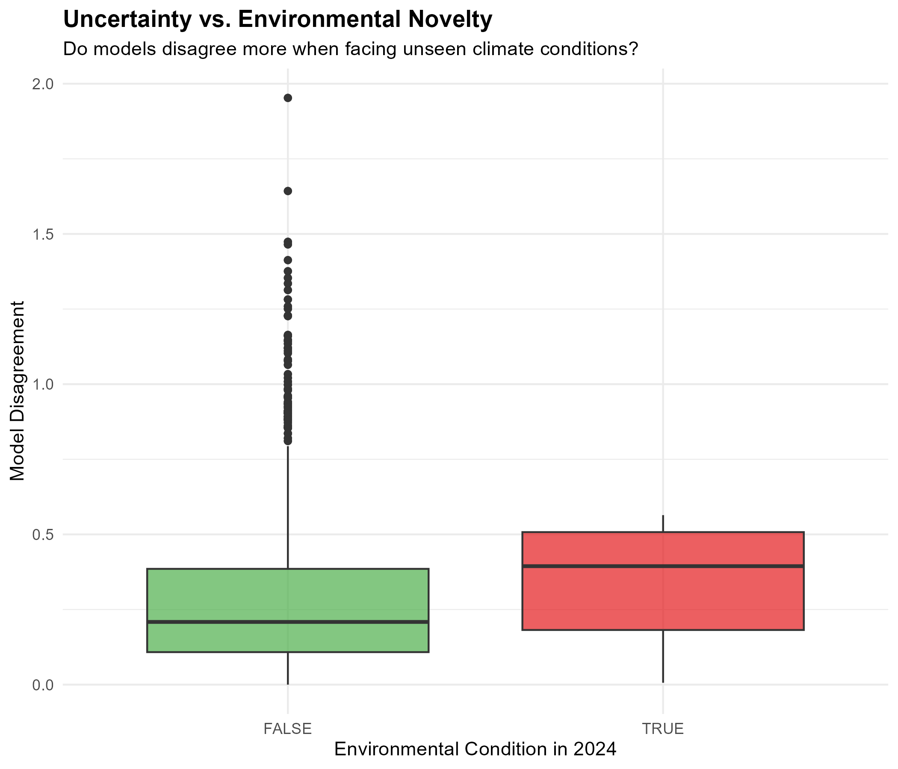

# Modelling Seasonal Vegetation Anomalies in the Cholistan Desert: A Reproducible Geospatial Machine Learning Approach with Uncertainty Quantification

**Author:** Aamna Naveed  
**Affiliation:** [Your University/Institution]  
**Date:** September 2024  
**Repository:** [https://github.com/AamnaNaveed/cholistan-vegetation-stress](https://github.com/AamnaNaveed/cholistan-vegetation-stress)

---

## Abstract
Vegetation dynamics in arid ecosystems are highly stochastic, driven by complex interactions between episodic rainfall, extreme temperatures, and land surface characteristics. This study presents a reproducible geospatial machine learning pipeline to model seasonal vegetation anomalies in the Cholistan Desert, Pakistan, using MODIS NDVI (2018–2024). Unlike traditional approaches that rely on static climate averages, this workflow integrates time-varying dynamic climate predictors (NASA POWER), terrain derivatives, and genuine MODIS land cover. To prevent temporal data leakage, the seasonal anomaly baseline was calculated strictly on the 2018–2023 training period. Generalized Additive Models (GAM) and Random Forest (RF) were evaluated using rigorous 4-fold spatial-block cross-validation and a 2024 temporal hold-out. Results indicate that RF outperformed GAM in capturing non-linear ecological responses (Mean Spatial CV R² = 0.261 vs. 0.180; 2024 Hold-out R² = 0.156 vs. 0.100). Model disagreement and a simplified environmental novelty screen were utilized to quantify predictive uncertainty, identifying specific spatiotemporal domains where model extrapolation limits reliability. This workflow demonstrates a robust, leakage-free framework for monitoring dryland vegetation stress under increasing climate variability.

---

## 1. Introduction
Dryland ecosystems, such as the Cholistan Desert in Pakistan, are highly vulnerable to climatic fluctuations and land-use changes. Monitoring vegetation stress in these environments is critical for ecological conservation and agricultural planning. Remote sensing, particularly the Moderate Resolution Imaging Spectroradiometer (MODIS) Normalized Difference Vegetation Index (NDVI), provides a continuous record of vegetation greenness. 

However, modelling vegetation stress in arid regions presents significant methodological challenges. First, static climate predictors (e.g., long-term WorldClim averages) fail to capture the episodic, time-varying nature of desert rainfall and heatwaves. Second, standard time-series analyses often suffer from temporal data leakage, where future data inadvertently influences historical baselines. Finally, complex machine learning models often act as "black boxes," lacking rigorous uncertainty quantification.

This study addresses these gaps by developing a reproducible R-based workflow that: (1) constructs a strictly leakage-free seasonal NDVI anomaly response; (2) integrates dynamic, time-varying climate predictors alongside genuine MODIS land cover; and (3) employs spatial-block cross-validation and environmental novelty screening to transparently quantify model uncertainty.

---

## 2. Study Area
The study focuses on the Cholistan Desert region in southern Punjab, Pakistan, encompassing the districts of Bahawalpur, Bahawalnagar, and Rahim Yar Khan (Figure 1). The region is characterized by an extreme continental desert climate, with summer temperatures frequently exceeding 45°C and highly erratic monsoon precipitation. The topography is predominantly flat, consisting of sand dunes and interdune plains, with elevations ranging from 73 to 175 meters above sea level.

*Figure 1: Geographical location of the Cholistan Desert study area.*

---

## 3. Materials and Methods

### 3.1 Data Acquisition
*   **Vegetation Data:** MODIS MOD13Q1 Version 6.1 (250m resolution, 16-day composite) NDVI data from 2018 to 2024.
*   **Dynamic Climate:** Monthly precipitation and temperature data were acquired via the NASA POWER API for each unique sample coordinate. 
*   **Terrain:** Elevation was derived from the SRTM Digital Elevation Model (DEM), and slope was calculated in degrees.
*   **Land Cover:** The MODIS MCD12Q1 Version 6.1 (2021) IGBP classification was used as an independent, static categorical predictor.

### 3.2 Response Variable Construction
To isolate vegetation stress from seasonal phenology, we calculated the standardized seasonal NDVI anomaly (Z-score). Crucially, to prevent temporal data leakage, the seasonal baseline (mean and standard deviation) was calculated **strictly using the 2018–2023 training period**, grouped by pixel (`latitude`, `longitude`) and `season`. The 2024 hold-out data was joined to this training-derived baseline without altering the baseline statistics.

### 3.3 Predictor Engineering
Static climate averages are insufficient for arid ecology. We engineered dynamic predictors:
1.  **Seasonal Precipitation:** Total accumulated rainfall for the current season.
2.  **Lagged Seasonal Precipitation:** Rainfall from the preceding season, serving as a proxy for soil moisture memory.
3.  **Seasonal Temperature:** Mean temperature for the current season.

### 3.4 Modelling and Validation Framework
We compared a Generalized Additive Model (GAM) to capture non-linear smooth effects, and a Random Forest (RF) algorithm to capture complex interactions. 
*   **Spatial Validation:** To mitigate spatial autocorrelation, the study area was partitioned into 4 K-means spatial blocks. Models were trained on 3 blocks and tested on the 4th.
*   **Temporal Validation:** Models were trained exclusively on 2018–2023 and evaluated on the unseen 2024 data.

### 3.5 Uncertainty and Environmental Novelty
Predictive uncertainty was proxied by the absolute disagreement between GAM and RF predictions. Environmental novelty was assessed using a simplified quantile-based screen, flagging 2024 observations where climate predictors fell outside the 5th–95th percentile range of the 2018–2023 training distribution.

---

## 4. Results

### 4.1 Spatiotemporal Patterns of NDVI Anomaly
The distribution of the seasonal NDVI anomaly (Figure 2) reflects the highly stochastic nature of the desert ecosystem. The strict separation of the 2024 hold-out period ensured that the baseline remained unbiased by recent extreme climatic events.

*Figure 2: Histogram of the standardized seasonal NDVI anomaly, demonstrating the distribution of stress and resilience classes.*

### 4.2 Model Performance and Validation
Random Forest consistently outperformed the GAM across both spatial and temporal validation metrics (Table 1). In the strict 2024 temporal hold-out, RF achieved an R² of 0.156 and an RMSE of 1.229, compared to the GAM's R² of 0.100 and RMSE of 1.288. While these R² values are modest, they represent an honest, leakage-free evaluation of predictive skill in a highly noisy desert environment.

| Model | Validation Type | Mean RMSE | Mean MAE | Mean R² |
| :--- | :--- | :--- | :--- | :--- |
| GAM | Spatial CV (4 Folds) | 0.921 | 0.719 | 0.180 |
| RF | Spatial CV (4 Folds) | 0.868 | 0.660 | 0.261 |
| GAM | Temporal Hold-out (2024) | 1.288 | 0.936 | 0.100 |
| RF | Temporal Hold-out (2024) | 1.229 | 0.894 | 0.156 |

*Table 1: Summary of model performance metrics. Spatial CV metrics represent the mean across 4 folds (N = 3,850 to 10,780 observations per fold). Temporal hold-out N = 4,179 observations. Exact fold-level metrics are available in `outputs/tables/spatial_cv_metrics.csv`.*

*Figure 3: Observed vs. Predicted NDVI Anomaly for the 2024 temporal hold-out (Random Forest).*

### 4.3 Predictor Importance and Partial Effects
The Random Forest model identified **seasonal temperature**, **seasonal precipitation**, and **lagged precipitation** as the variables with the highest predictive importance (Figure 4). This validates the necessity of time-varying climate data over static averages. The GAM partial effects (Figure 5) revealed a distinct U-shaped response to temperature, with vegetation stress peaking at extreme cold (<15°C) and extreme heat (>35°C).

*Figure 4: Predictor importance based on impurity decrease in the Random Forest model.*

*Figure 5: Partial effect plots from the GAM, showing non-linear relationships between predictors and NDVI anomaly.*

### 4.4 Uncertainty and Environmental Novelty
Analysis of model disagreement revealed that uncertainty is not uniformly distributed. As shown in Figure 6, model disagreement was significantly higher for observations classified as "environmentally novel" (experiencing climate conditions outside the historical training distribution). 

*Figure 6: Boxplot showing that model disagreement (uncertainty proxy) increases under novel environmental conditions.*

---

## 5. Discussion

### 5.1 Ecological Interpretation of Predictors
The strong predictive importance of lagged precipitation highlights the critical role of soil moisture memory in dryland ecosystems. Vegetation in Cholistan does not merely respond to immediate rainfall; it relies on antecedent moisture stored in the soil profile. Furthermore, the U-shaped temperature response curve aligns with physiological limits of desert flora, where extreme heat induces stomatal closure and photoinhibition.

### 5.2 Methodological Rigor and Leakage Prevention
A major contribution of this workflow is the strict enforcement of temporal boundaries. By calculating the anomaly baseline exclusively on the 2018–2023 training data, we prevented the model from "peeking" at the 2024 test period. This results in lower, but scientifically honest, performance metrics compared to studies that inadvertently leak future data into their baselines.

### 5.3 Limitations and Uncertainty
This study identifies *predictive associations*, not causal drivers. Unobserved factors, such as localized groundwater extraction or grazing pressure, may influence the residuals. Furthermore, the environmental novelty screen is a simplified quantile-based approach rather than a full Multivariate Environmental Similarity Surfaces (MESS) implementation. Areas flagged with high model disagreement and high novelty should be treated as candidate priorities for field validation, rather than confirmed ecological stress hotspots.

---

## 6. Conclusion
This study successfully developed a reproducible, leakage-free geospatial machine learning pipeline for monitoring vegetation stress in the Cholistan Desert. By integrating dynamic climate predictors, genuine MODIS land cover, and rigorous spatial-temporal validation, the workflow provides a robust framework for arid ecosystem monitoring. The explicit quantification of uncertainty and environmental novelty ensures that model predictions are interpreted cautiously, highlighting specific areas where remote sensing must be supplemented with ground-truthed field data.

---

## References
1. Running, S. W., et al. (2004). MODIS land cover product algorithm theoretical basis document.
2. Wood, S. N. (2017). Generalized Additive Models: An Introduction with R.
3. Breiman, L. (2001). Random Forests. Machine Learning, 45(1), 5-32.
4. NASA POWER Project. (2024). Prediction of Worldwide Energy Resources.